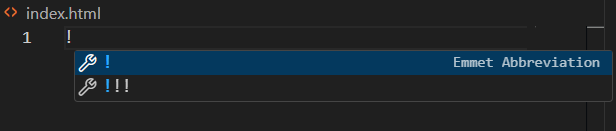

# Writing an HTML Boilerplate

In HTML, when you first create your file, you need to write a boilerplate to use as a template that you can add to later. This guide will assist you on how to write a boilerplate for your HTML Index.

## Before We Begin
We must make an HTML file. You can do this in two ways, through your **terminal** or by creating a new file in your *Visual Studio Code* text editor.
### Terminal Method
To create an index file in your **terminal**,
navigate to what *directory* you want the file to be in, or create your own *directory* with the **command** 

`mkdir` 

 Now, in your *directory* type the **command**:

`touch index.html`

Now enter your *Visual Studio Code* text editor by entering the **command**

 `code .`

### Create New Text File Method
Enter your *Visual Studio Code* text editor by typing the **command**

 `code .` 

 in your **terminal**. Then navigate to your *explorer* tab in the top left, hover over your file name and a series of buttons will appear. Select the button that says *New  File*. Name the new file ***index.html***.
 ## Creating the Emmet Abbreiviation
 In your ***index.html*** file, on line one write `!`. *Visual Studio Code* will offer up an autofill options. Select the first one.
 
 If you do not need to link *css* or *javascript* then congratulations, you have your boilerplate!
 ## Linking your HTML File to CSS and Javascript Files.
 Now, to link your *css* and *javascript* files.
 #### CSS Link :
  In your ***index.html***  file in your **Head tag**
 ```html
 <head>

</head>
```
write
```html
<link rel="stylesheet" type="text/css" href="style.css" />
```
This will link your html file to your style.css file. 
#### MAKE SURE THAT `href={yourCssFileName}` IS SPELT THE SAME AS YOUR CSS FILE NAME

#### Javascript Link:

In your ***index.html***  file in your **Head tag**
 ```html
 <head>

</head>
```
write
```html
<script defer src="./script.js"></script>
```
This will link your html file to your script.js file. 
#### MAKE SURE THAT `href={yourJavascriptFileName}` IS SPELT THE SAME AS YOUR JAVSCRIPT FILE NAME

 For a more in depth guide on boilerplates, refer to this site:[The Odin Project's HTML Boilerplate](https://www.theodinproject.com/lessons/foundations-html-boilerplate)